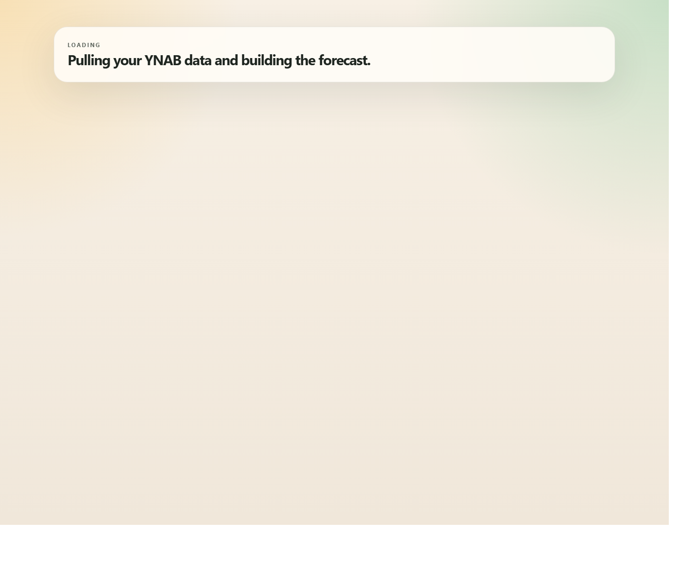
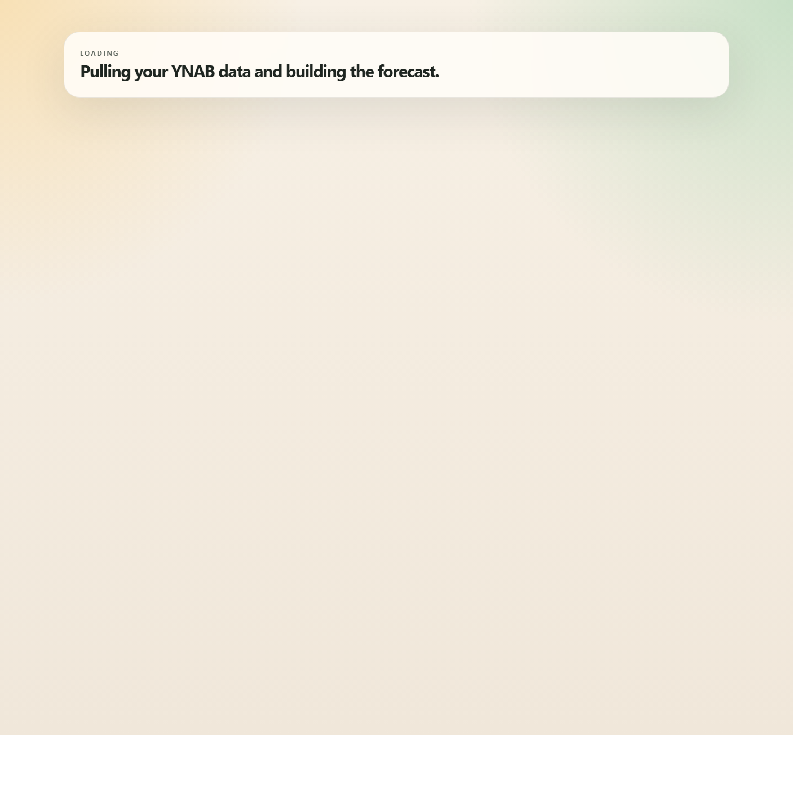

# YNAB Goal Forecast Dashboard

This project adds a planning layer on top of YNAB so you can answer questions like:

- Am I still on track to hit my dated goals?
- How much monthly room do I really have after essentials, flexible spending, and wealth-building are considered?
- If I make a large purchase, which goals slip first?
- If my plan is short, how much should I cut from flexible or wealth categories?

## Screenshots

Screenshots below show the main planning dashboard and the per-category trends view.

## Key Views

- `Goal dashboard`: full-plan goal pacing, purchase stress testing, bucket assignment, and cut suggestions
- `Category trends`: per-category planning target, recent spending trend, latest month, average spend, and target gap

## Open Source And Collaboration

This repo is public and open to collaboration.

- License: `MIT`
- Safe setup: each user should create their own local `.env`
- Required secrets stay local: `YNAB_ACCESS_TOKEN` and `YNAB_PLAN_ID`

If you want to contribute:

1. Fork the repo or open an issue first for larger changes.
2. Keep any real YNAB tokens, plan IDs, or exported budget payloads out of commits.
3. Use `.env.example` as the template for local setup.
4. Prefer changes that keep the forecasting assumptions transparent and explainable.

## Product Goal

The dashboard is meant to be a conservative planning tool, not just a historical report.

It tries to answer:

1. What is my realistic monthly funding room for goals?
2. Which goals are safe under my full monthly plan?
3. How much buffer do I have for a large purchase?
4. What tradeoffs are required if my goals, spending, and savings habits do not all fit together?

## Data Source

The app reads from the YNAB API via `server.mjs`.

The payload includes:

- budget/plan metadata
- category metadata
- category targets
- dated goals
- recurring targets
- recent monthly spending snapshots
- recent income snapshots

By default, the server loads the last `YNAB_MONTHS_TO_ANALYZE` complete months.

## High-Level Model

The model splits non-goal categories into buckets:

- `essential`: protected first
- `flexible`: lifestyle/discretionary spending that competes with goals
- `wealth`: saving/investing habits that also compete with goals
- `ignore`: removed from planning math

Dated goals are modeled separately and funded from a shared monthly goal pool.

## Core Formulas

### 1. Income

Historical income is a weighted average of recent complete months.

Formula:

`weighted average = sum(month_value * month_weight) / sum(weights)`

Weights increase with recency.

Example for 3 months:

- oldest month weight = `1`
- middle month weight = `2`
- newest month weight = `3`

So if income for the 3 complete months is:

- December = `D`
- January = `J`
- February = `F`

Then:

`historicalAvgIncome = (1*D + 2*J + 3*F) / 6`

If the user enters a manual forecasted monthly income in the sandbox, that value replaces the historical income baseline.

Formula:

`avgIncome = manualForecastedIncome ?? historicalAvgIncome`

### 2. Essential Spending

Essential spending can be modeled in two modes.

#### Target mode (default)

The app sums the planning amount for each essential category.

For each essential category:

`planning amount = category target if present, otherwise average monthly spend`

Then:

`targetProtectedSpending = sum(planning amount for all essential categories)`

And:

`avgProtectedSpending = targetProtectedSpending`

#### Average mode

The app uses a weighted average of recent monthly essential spending.

For each analyzed month:

`monthly essential spending = sum(spending in essential categories)`

Then:

`baselineProtectedSpending = weightedAverage(monthly essential spending)`

And:

`avgProtectedSpending = baselineProtectedSpending`

### 3. Flexible Spending

Flexible spending can be modeled in two modes.

#### Target mode (default)

The app sums category targets for all flexible categories.

Formula:

`targetFlexibleSpending = sum(targetAmountForPlanning for all flexible categories)`

Then, with no manual sandbox override:

`adjustedFlexibleSpending = targetFlexibleSpending`

The conservative flexible assumption in target mode is:

`conservativeFlexibleSpending = max(adjustedFlexibleSpending, targetFlexibleSpending)`

Which reduces to:

`conservativeFlexibleSpending = targetFlexibleSpending`

unless the user enters an even larger manual flexible target.

#### Average mode

The app calculates:

`baselineFlexibleSpending = average(monthly flexible spending)`

It also calculates:

`worstFlexibleSpending = max(monthly flexible spending)`

Then the conservative flexible assumption is:

`conservativeFlexibleSpending = max(adjustedFlexibleSpending, worstFlexibleSpending)`

So average mode still uses a conservative floor based on the worst recent month.

### 4. Wealth Spending

Wealth is treated as planned saving/investing, not spending behavior.

Default formula:

`targetWealthBuildingSpending = sum(targetAmountForPlanning for all wealth categories)`

If the user enters a manual wealth-building target, that value is used as the initial planned value.

Formula:

`adjustedWealthBuildingSpending = manualWealthTarget ?? targetWealthBuildingSpending`

Then the model uses a conservative target floor:

`conservativeWealthBuildingSpending = max(adjustedWealthBuildingSpending, targetWealthBuildingSpending)`

This means wealth is target-based by default and will not fall below the category target total unless the user explicitly changes the category targets or bucket assignments.

### 5. Free Cash Flow

Formula:

`freeCashFlow = avgIncome - avgProtectedSpending`

This is the monthly room left after income and essential obligations are accounted for.

### 6. Goal Funding Pool

Goals do not each get their own full free cash flow. They share one pool.

Formula:

`totalAvailableForGoalsUnderFullPlan = freeCashFlow - conservativeFlexibleSpending - conservativeWealthBuildingSpending`

This is the key “shared monthly capacity” concept.

### 7. Dated Goal Math

For each dated goal:

`amountRemaining = max(0, targetAmount - currentAvailable)`

`actualMonthsRemaining = monthsUntilDue(goalDueDate)`

`planningMonths = manualMonthsToAchieve ?? actualMonthsRemaining`

`requiredMonthlyContribution = amountRemaining / planningMonths`

`plannedMonthlyContribution = manualPlannedContribution ?? requiredMonthlyContribution`

### 8. Goal Priority and Funding Order

Goals are funded from the shared goal pool in this order:

1. lower priority number first
2. earlier due date next
3. higher required monthly contribution next

Each goal receives up to its planned monthly contribution until the shared pool runs out.

Pseudo-formula:

`fundedThisMonth = min(plannedMonthlyContribution, remainingGoalPool)`

Then:

`gapThisMonth = max(0, requiredMonthlyContribution - fundedThisMonth)`

### 9. Goal Status

Current goal status is based on the full monthly plan.

Rules:

- `Off track` if `freeCashFlow <= 0`
- `At risk` if `fundedThisMonth < requiredMonthlyContribution`
- `On track` otherwise

### 10. Monthly Buffer

Formula:

`monthlyBufferAfterGoals = freeCashFlow - totalPlannedForGoals - conservativeFlexibleSpending - conservativeWealthBuildingSpending`

Interpretation:

- positive = room remains after all current planned assumptions
- negative = the plan is oversubscribed

### 11. Purchase Stress Test

Formula:

`scenarioRemainingBuffer = monthlyBufferAfterGoals - purchaseAmount`

The app also recomputes the goal funding pool under the scenario:

`scenarioGoalPool = max(0, totalAvailableForGoalsUnderFullPlan - purchaseAmount)`

Then it reallocates goals in priority order and shows which goals slip first.

### 12. Cut Suggestions

If the plan is short, the app estimates a monthly shortfall.

Formula:

`goalShortfall = max(0, totalRequiredForGoals - totalAvailableForGoalsUnderFullPlan)`

`bufferGap = max(0, -monthlyBufferAfterGoals)`

`overallShortfall = max(goalShortfall, bufferGap)`

Then the app suggests cuts in this order:

1. flexible categories first
2. wealth categories second if flexible cuts are not enough

Within each bucket, categories are ranked by current modeled level.

For flexible cuts:

- if flexible mode is target-based, current level = target amount
- if flexible mode is average-based, current level = average monthly spend

For wealth cuts:

- current level = wealth target amount

## Current Assumptions

### Income assumptions

- only recurring inflow candidates are counted by default
- one-off refunds, reimbursements, starting balances, and reconciliation adjustments are excluded
- manual forecasted monthly income overrides historical income completely

### Spending assumptions

- the app uses complete months only
- the current partial month is excluded from trend analysis
- internal/reimbursement-style categories are excluded from spending trends
- category targets are treated as the preferred conservative baseline for essential, flexible, and wealth buckets when target mode is enabled

### Goal assumptions

- only categories with both a target amount and target date are shown as dated goals
- recurring monthly target categories are treated as ongoing plan categories, not countdown goals
- lower priority number means more protection when money is tight

## Why Shock Months Matter Differently

The app tries to avoid making one unusual month define the whole future, but some effects still matter.

Examples:

- a one-time dentist bill in an essential category may raise average-based essential spending if essential mode is set to `average`
- if essential mode is set to `target`, that shock matters less because the target is used instead of the spending average
- if money is moved out of a dated goal category like `Relocation`, that goal's `currentAvailable` decreases, which correctly increases how much the goal still needs

So the model is meant to capture the tradeoff that really matters:

- category refill pressure
- reduced goal balances
- reduced future room for other goals

## How to Audit the Dashboard

If you want to verify the numbers manually, check them in this order:

1. Confirm bucket assignments.
2. Confirm which months are included in the average window.
3. Confirm target totals for essential, flexible, and wealth categories.
4. Confirm the manual forecasted monthly income, if any.
5. Confirm each goal's priority, months to achieve, and planned monthly contribution.
6. Confirm the shared goal pool calculation.
7. Confirm goal funding order and resulting `fundedThisMonth` values.

## Main Files

- `server.mjs`: pulls and normalizes YNAB data
- `src/lib/forecast.js`: core planning formulas
- `src/App.jsx`: dashboard UI and sandbox controls

## Future Improvements

Possible next steps:

- dynamic UI display of exact analyzed months from the payload everywhere
- category-level priority for flexible/wealth cut suggestions
- better treatment of irregular true-expense categories
- saved planning presets
- charts for income, targets, and spending trends

## Exact Due Date And Income Timing

The dashboard now uses the exact goal due date together with a user-provided monthly income timing choice.

Formula:

- choose an income timing: `first`, `last`, or `custom day`
- find the next income arrival date after today
- count how many income arrivals occur on or before the goal due date
- use that count as the default planning window for the goal

So if today is March 30, income timing is `last day of each month`, and a goal is due May 31, the default planning window is based on the April 30 and May 31 pay cycles.

If the sandbox `Income arrivals to achieve` value is changed manually for a goal, that override replaces the automatically counted income arrivals.
